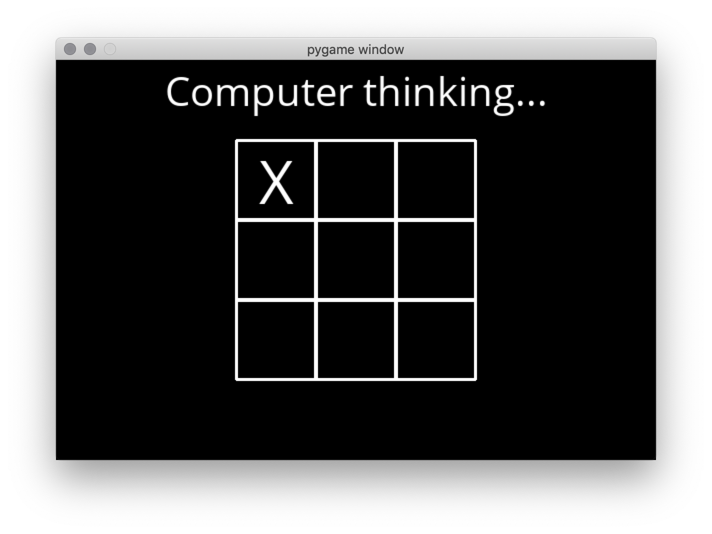

This is the [tictactoe project](https://cs50.harvard.edu/ai/projects/0/tictactoe/) of [CS50’s
Introduction to Artificial Intelligence with Python](https://cs50.harvard.edu/ai/).

This is an implementation and application example of the [minimax algorithm](https://en.wikipedia.org/wiki/Minimax).

# Usage
Install the required packages : 
```
pip3 install -r requirements.txt
```
and then :
```
python3 runner.py
```

# Screenshot
Please not the pygame interface is already in the project's source.

